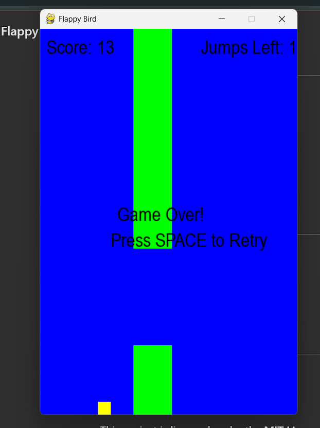

# 🐦 Flappy Bird - Pygame Edition

🚀 **A fun and engaging Flappy Bird clone built using Python and Pygame!**

## 📌 Features

✅ **Smooth Gameplay** - Experience a simple yet addictive game with fluid animations.  
✅ **Custom Gravity & Speed** - Adjusted gravity, jump strength, and pipe speed for a unique feel.  
✅ **Dynamic Pipe Generation** - Pipes appear at different heights to keep the challenge alive.  
✅ **Score Tracking** - Earn points as you navigate through the pipes.  
✅ **Jump Limits & Recharge** - Adds an extra layer of strategy with a maximum jump count.  
✅ **Game Over & Retry** - Press `SPACE` to restart when the game is over.  
✅ **Realistic Bird Movement** - Enhanced physics for a natural flying experience.  

---

## 🛠️ Technologies Used

🔹 **Programming Language:** Python 🐍  
🔹 **Game Engine:** Pygame 🎮  
🔹 **Graphics:** Basic Shapes & Colors 🎨  
🔹 **Physics:** Custom Gravity & Collision Detection ⚙️  

---

## 🚀 Installation & How to Run

1️⃣ **Clone the repository:**  
```bash
$ git clone <repository-url>
$ cd flappy-bird-game
```

2️⃣ **Install dependencies:**  
```bash
$ pip install pygame
```

3️⃣ **Run the game:**  
```bash
$ python game.py
```

---

## 🎮 Controls

🎯 **Up Arrow (⬆️)** - Jump  
🎯 **Down Arrow (⬇️)** - Fast descend  
🎯 **SPACE** - Restart after Game Over  

---

## 📷 Screenshots




---

## 📜 License

This project is licensed under the **MIT License**. Feel free to modify and distribute!  

💡 **Enjoy the game and have fun coding!** 🚀🎮

